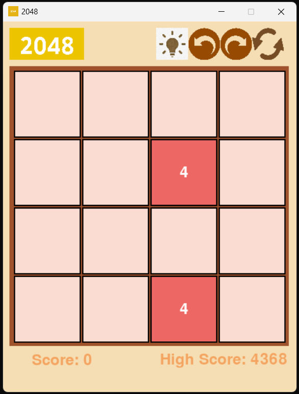

# 2048 Game using Pygame

## Description

This project is a simple implementation of the popular 2048 game using the Pygame library in Python. The objective of the game is to slide numbered tiles on a grid to combine them and create a tile with the number 2048.

## Features

- Classic 2048 gameplay
- Intuitive keyboard controls
- Smooth animations
- Score tracking

## Installation

### Prerequisites

- Python 3.x
- Pygame library

### Install Pygame

You can install Pygame using pip:

```bash
pip install pygame
```

## Usage

1. Clone the repository or download the source code.

```bash
git clone https://github.com/yourusername/2048-pygame.git
cd 2048-pygame
```

2. Run the game.

```bash
python main.py
```

## Controls

- **Up Arrow**: Move tiles up
- **Down Arrow**: Move tiles down
- **Left Arrow**: Move tiles left
- **Right Arrow**: Move tiles right

## How to Play

- Use the arrow keys to move the tiles.
- When two tiles with the same number touch, they merge into one.
- The goal is to create a tile with the number 2048.
- The game is over when there are no more valid moves.

## Screenshot



## License

This project is licensed under the MIT License. See the [LICENSE](LICENSE) file for details.

## Acknowledgements

- Inspired by the original 2048 game by Gabriele Cirulli.
- Developed using the Pygame library.
